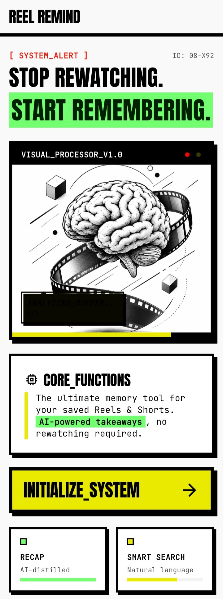
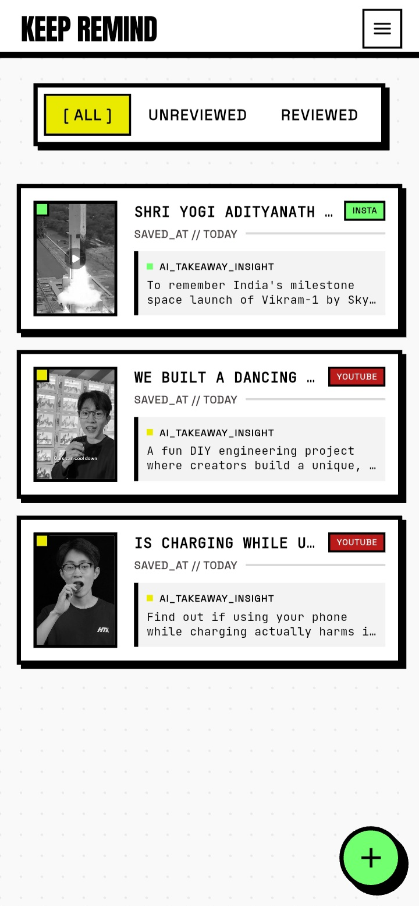
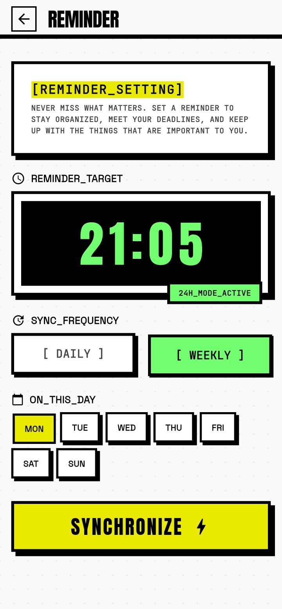
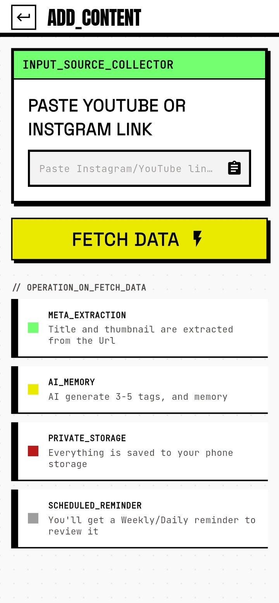

# KeepRemind — Smart Link Bookmark & AI Memory Assistant

**Save it. Remember why it mattered. Revisit it later.**

KeepRemind is a Flutter mobile app that helps you save, organize, and revisit interesting content from social media and the web.

Instead of simply bookmarking links, KeepRemind extracts useful metadata, generates AI-powered memory notes and tags using Google Gemini, and schedules reminders so you remember **why you saved something in the first place**.

## 📥 Download

Download the latest Android APK from the latest GitHub Release.

[⬇️ Download KeepRemind APK](https://github.com/Rohiitt405/KeepRemind/releases/latest)

---
## 📸 Screenshots

<details>
<summary><strong>View app screenshots</strong> 📱</summary>

<br>

<p align="center">
  
</p>

<p align="center">
  
</p>

<p align="center">
  
</p>

<p align="center">
  
</p>

<p align="center">
  
</p>

<p align="center">
  
</p>

</details>

---

## ✨ Features

### 🔗 Save & Organize

* **🔗 Save Content** — Save links directly from the Android share sheet.
* **🌐 Multi-Platform Support** — Save content from YouTube, Instagram, TikTok, Reddit, Facebook, X (Twitter), LinkedIn, Pinterest, Threads, Snapchat, and Open Graph-enabled websites.
* **📝 Smart Organization** — Organize saved content into All, Reviewed, and Unreviewed views.
* **🎯 Share Intent Support** — Share links directly to KeepRemind from other apps.
* **🗑️ Easy Management** — Swipe to delete saved content with confirmation dialogs.

### 🤖 AI-Powered Memory

* **🧠 AI Memory Notes** — Generate concise memory prompts explaining why you saved each link.
* **🏷️ Smart Tags** — Automatically generate relevant tags for saved content.
* **⚡ Background Processing** — AI generation runs in the background without blocking the UI.
* **🔁 Intelligent Retries** — Uses retry logic with exponential backoff for transient AI failures.

### 📌 Metadata & Reminders

* **📌 Smart Metadata Extraction** — Extract titles, descriptions, thumbnails, and platform information using Open Graph metadata with fallback handling.
* **🧠 Intelligent Platform Detection** — Automatically detect the source platform and adapt processing accordingly.
* **🔔 Flexible Reminders** — Schedule daily or weekly reminders to revisit saved content.
* **🔄 Automatic Updates** — Check GitHub Releases for new versions, view release notes, download the latest APK, and skip specific versions.
* **🎨 Material Design 3** — Modern interface built with Material Design 3.

### 💾 Backup & Restore

* **💾 Local Backup** — Export your saved content and related data as a backup file for safekeeping.
* **🔄 Restore Backup** — Import a previously created KeepRemind backup and restore saved content.
* **🛡️ Duplicate Protection** — Existing saved links are not duplicated when restoring a backup.
* **⚡ Immediate Sync** — Restored content is synchronized with the app state and becomes visible on the Home screen immediately after restoration.

---

## 🌐 Supported Platforms

KeepRemind supports content from major social platforms as well as websites that provide Open Graph metadata.

| Platform       | Metadata    | AI Memory | Status          |
| -------------- | ----------- | --------- | --------------- |
| YouTube        | ✅          | ✅        | Fully Supported |
| Instagram      | ✅          | ✅        | Fully Supported |
| Reddit         | ✅          | ✅        | Fully Supported |
| LinkedIn       | ✅          | ✅        | Fully Supported |
| Pinterest      | ✅          | ✅        | Fully Supported |
| X (Twitter)    | ✅          | ✅        | Fully Supported |
| Facebook       | ⚠️ Fallback | ✅        | Supported       |
| Threads        | ⚠️ Fallback | ✅        | Supported       |
| Snapchat       | ⚠️ Fallback | ✅        | Supported       |
| Other Websites | Open Graph  | ✅        | Supported       |

---
## 🔄 How It Works

### 🔗 Link Processing Pipeline

When a link is added, KeepRemind processes it through the following pipeline:

```text
Link
  ↓
Platform Detection
  ↓
Metadata Extraction
  ↓
Fallback Metadata (if required)
  ↓
Save to Firestore
  ↓
AI Memory & Tag Generation
  ↓
Reminder Scheduling
```

This modular architecture allows new social platforms to be added with minimal changes.

### 🔄 Automatic Updates

KeepRemind includes a built-in update checker powered by GitHub Releases.

The update flow:

1. Check the latest GitHub release.
2. Compare it with the installed app version.
3. Show an update dialog when a newer version is available.
4. Allow users to view release notes before updating.
5. Open the latest APK download when **Update** is selected.
6. Allow users to **Skip Version**.
7. Store the skipped version locally so the same update does not trigger the dialog again.

### 💾 Backup & Restore

KeepRemind allows users to export their saved content as a backup file and restore it later.

#### Backup Flow

```text
Saved Content
     ↓
Backup Service
     ↓
Create Backup Data
     ↓
Generate Backup File
     ↓
Save / Share Backup File
```

#### Restore Flow
```text
Backup File
     ↓
File Selection
     ↓
Backup Validation
     ↓
Duplicate Detection
     ↓
Restore Data
     ↓
Firestore
     ↓
SavedLinkProvider
     ↓
Home Screen
```

#### Update System Highlights

* Automatic update notifications
* Semantic version comparison
* Release notes support
* Direct APK downloads
* Cached update checks to reduce unnecessary network requests

---

## 🛠️ Technology Stack

| Category                | Technology                              |
| ----------------------- | --------------------------------------- |
| **Frontend**            | Flutter 3.9.2+                          |
| **State Management**    | Provider 6.1.5                          |
| **Backend**             | Firebase (Auth, Firestore, Storage)     |
| **AI**                  | Google Gemini 3.5 Flash via Firebase AI |
| **Notifications**       | flutter_local_notifications             |
| **Data Persistence**    | Cloud Firestore + SharedPreferences     |
| **Backup & Restore**    | Local file export/import                |
| **Metadata Extraction** | metadata_fetch                          |
| **UI Design**           | Material Design 3                       |

### Folder Overview

| Folder       | Description                                                                                                    |
| ------------ | -------------------------------------------------------------------------------------------------------------- |
| `constants/` | Application-wide constants and configuration                                                                   |
| `models/`    | Data models used throughout the application                                                                    |
| `providers/` | Application state management using Provider                                                                    |
| `services/`  | Business logic, Firebase operations, backup and restore, AI integration, metadata processing, notifications, and update management |
| `utils/`     | Shared utility classes and helper functions                                                                    |
| `screens/`   | Complete application screens                                                                                   |
| `widgets/`   | Reusable UI components shared across the application                                                           |

---
## 🏗️ Architecture

KeepRemind follows a modular Flutter architecture that separates UI, state management, business logic, data models, and reusable components.

```text
lib/
├── main.dart
├── app.dart
├── firebase_options.dart
│
├── constants/
│   ├── app_theme.dart
│   └── github_constants.dart
│
├── exceptions/
│   └── backup_exception.dart
│
├── models/
│   ├── ai_memory.dart
│   ├── backup_result.dart
│   ├── link_metadata.dart
│   ├── restore_result.dart
│   ├── saved_link_model.dart
│   ├── social_platform.dart
│   └── update_info.dart
│
├── providers/
│   ├── saved_link_provider.dart
│   └── update_provider.dart
│
├── screens/
│   ├── add_url_screen.dart
│   ├── backup_screen.dart
│   ├── detail_screen.dart
│   ├── home_screen.dart
│   ├── onboarding_screen.dart
│   ├── settings_screen.dart
│   ├── share_loading_screen.dart
│   └── splash_screen.dart
│
├── services/
│   ├── metadata/
│   │   ├── fallback_metadata_service.dart
│   │   ├── metadata_fetch_service.dart
│   │   ├── metadata_service.dart
│   │   └── platform_detector_service.dart
│   │
│   ├── ai_service.dart
│   ├── backup_service.dart
│   ├── firestore_service.dart
│   ├── notification_service.dart
│   ├── reminders_service.dart
│   └── update_service.dart
│
├── utils/
│   └── version_helper.dart
│
└── widgets/
    ├── save_link_card.dart
    ├── update_dialog.dart
    └── shared/
        ├── dot_grid_overlay.dart
        └── neo_brutalist_button.dart
```

---

## 🚀 Getting Started

### Prerequisites

Before running KeepRemind, make sure you have:

* Flutter SDK 3.9.2 or higher
* Android Studio or Xcode for platform setup
* A Firebase project with the required services enabled
* A Google Cloud project with Gemini API access

### Installation

**1. Clone the repository**

```bash
git clone https://github.com/Rohiitt405/KeepRemind.git
cd KeepRemind
```

**2. Install dependencies**

```bash
flutter pub get
```

**3. Configure Firebase**

```bash
flutterfire configure
```

This generates `firebase_options.dart` with your Firebase configuration.

**4. Run the app**

```bash
flutter run
```

### Firebase Configuration

KeepRemind uses anonymous Firebase authentication. Saved links are stored under:

```text
users/{userId}/saved_links/
```

Make sure your Firestore security rules allow authenticated users to access only their own data:

```firestore
rules_version = '2';

service cloud.firestore {
  match /databases/{database}/documents {
    match /users/{userId} {
      allow read, write:
        if request.auth != null &&
           request.auth.uid == userId;

      match /saved_links/{savedLinkId} {
        allow read, write:
          if request.auth != null &&
             request.auth.uid == userId;
      }
    }
  }
}
```

---

## 🔐 Security & Privacy

* **Anonymous Authentication** — No user login is required; each device receives a unique Firebase UID.
* **Data Isolation** — Each user's saved links are isolated within their own Firestore subcollection.
* **No Personal Data** — The app does not collect emails, names, or other identifiable information.
* **Local Settings** — Reminder preferences are stored locally on the device.
* **Third-Party Links** — KeepRemind supports major social platforms and websites that expose Open Graph metadata.

---

## 🧩 Key Components

### `SavedLink`

Represents a saved link along with its metadata and AI-generated insights.

```dart
SavedLink(
  id: String,
  url: String,
  title: String,
  caption: String,
  thumbnailUrl: String,
  platform: SocialPlatform,
  aiMemory: String?,
  aiTags: List<String>?,
  isGenerating: bool,
  savedAt: DateTime,
  isReviewed: bool,
)
```

### `SavedLinkProvider`

Manages the saved-link lifecycle:

* Real-time Firestore updates
* URL validation
* AI insight generation with retry logic
* Reminder scheduling
* Review and deletion state
* Refreshes saved-link state after backup restoration

### `UpdateProvider`

Manages application update state:

* Checks for available updates
* Handles skipped update versions
* Removes skipped updates from the UI

### `UpdateService`

Handles GitHub Release update checks:

* Fetches the latest GitHub release
* Compares installed and latest versions
* Checks whether a version was previously skipped
* Prevents repeated update prompts for skipped versions

### `FirestoreService`

Handles database operations:

* Anonymous authentication
* Real-time saved-link streams
* CRUD operations
* User-scoped data isolation

### `BackupService`

Handles local backup and restore operations:

* Creates backup files from saved application data
* Validates imported backup data
* Restores saved content to Firestore
* Detects and skips duplicate saved links
* Returns structured backup and restore results
* Handles backup-specific exceptions

### `AIService`

Generates AI memory notes and tags using Gemini:

* Parses AI JSON responses with fallback handling
* Implements exponential retry logic
* Handles transient API errors
* Supports flexible tag extraction

### `NotificationService`

Manages scheduled reminders:

* Weekly reminders on a selected weekday
* Daily reminders at a selected time
* Timezone-aware scheduling
* Singleton-based notification management

---

## 🔄 User Flow

### 👋 Onboarding

1. First-time users see the onboarding screen.
2. The app explains how to share links to KeepRemind.
3. Users can optionally grant notification permission.
4. Onboarding completion is stored in `SharedPreferences`.

### 🔗 Saving a Link

```text
Paste or share a supported link
        ↓
Platform Detection
        ↓
Fetch Metadata
(title, description, thumbnail)
        ↓
Save to Firestore
(isGenerating: true)
        ↓
Show Content in UI Immediately
        ↓
┌─────────────────────────────────────┐
│ Background Processing               │
│                                     │
│ • Generate AI Memory                │
│ • Generate Tags                     │
│ • Schedule Weekly Reminder          │
└─────────────────────────────────────┘
        ↓
Real-time UI Update as AI Processing Completes
```

---

### Reviewing savedLinks
1. Home screen displays savedLink in three tabs: All, Unreviewed, Reviewed
2. Tap a savedLink to view full details with thumbnail and AI insights
3. Mark as reviewed to track progress
4. Swipe to delete with confirmation

### Reminders
- Toggle notification mode (daily/weekly)
- Set reminder day and time
- View app info

### 💾 Backup & Restore

#### Creating a Backup

1. Open the Backup & Restore option from the Home screen.
2. Select **BACKUP DATA**.
3. KeepRemind creates a backup file containing your saved content.
4. Save the backup file to a location of your choice.

#### Restoring a Backup

1. Open the Backup & Restore option from the Home screen.
2. Select **RESTORE DATA**.
3. Choose a previously created KeepRemind backup file.
4. KeepRemind validates the backup data.
5. Existing duplicate links are skipped.
6. New saved content is restored.
7. The restored content is synchronized with the app and becomes visible on the Home screen.

---

## 🌍 Supported Link Types

KeepRemind can save and organize different types of web content, including:

- 🎬 Short-form videos
- 📺 Long-form videos
- 📱 Social media posts
- 📰 Articles and news pages
- ✍️ Blogs
- 💻 GitHub repositories
- 📚 Documentation
- 🎓 Educational resources
- 🌐 Open Graph-enabled websites

---

## 📦 Dependencies

### Production

* `flutter` — UI framework
* `firebase_core` — Firebase initialization
* `cloud_firestore` — Real-time database
* `firebase_auth` — Authentication
* `firebase_storage` — File storage
* `firebase_ai` — Gemini AI integration
* `provider` — State management
* `metadata_fetch` — URL metadata extraction
* `flutter_local_notifications` — Local reminders
* `timezone` / `flutter_timezone` — Timezone handling
* `receive_sharing_intent` — Share sheet integration
* `shared_preferences` — Local storage
* `cached_network_image` — Image caching
* `url_launcher` — Open external links
* `google_fonts` — Custom fonts
* `http` — HTTP networking
* `package_info_plus` — App version information
* `font_awesome_flutter` — Social media and UI icons

### Development

* `flutter_lints` — Code quality and linting
* `flutter_launcher_icons` — App icon generation

---

## 👨‍💻 Development Guide

### Adding a New Feature

Follow the existing project structure when adding new functionality:

1. **Create a Model** — Add or update a model in `lib/models/` if required.
2. **Create a Service** — Add business logic in `lib/services/`.
3. **Create a Provider** — Add state management in `lib/providers/`.
4. **Create UI Screens** — Add complete screens in `lib/screens/`.
5. **Create Reusable Widgets** — Add shared UI components in `lib/widgets/`.
6. **Update Routing** — Update `app.dart` when new navigation is required.
7. **Publish Releases** — Publish APKs through GitHub Releases for automatic update detection.

### Key Development Patterns

* **Provider Pattern** — Uses `ChangeNotifier` for reactive state updates.
* **Service-Based Architecture** — Business logic is separated into focused services.
* **Stream-Based Updates** — Firestore snapshots provide real-time data updates.
* **Result-Based Operations** — Backup and restore return structured result models instead of exposing service details to the UI.
* **Error Handling** — Uses try/catch with user-friendly error messages.
* **Async Operations** — Uses `Future`-based operations with loading states.

---

## 🐛 Debugging

### Debug Logs

Use Flutter's debug utilities when troubleshooting:

```dart
debugPrint('Your debug message');
debugPrintStack();
```

### Application Logs

View Flutter application logs with:

```bash
flutter logs
```

---

## 🤝 Contributing

Contributions are welcome! 🎉

If you'd like to improve KeepRemind, follow the workflow below.

### 1. Fork the Repository

Click the **Fork** button on GitHub to create your own copy of the repository.

### 2. Clone Your Fork

```bash
git clone https://github.com/<your-username>/KeepRemind.git
cd KeepRemind
```

### 3. Create a Branch

```bash
git checkout -b feature/your-feature-name
```

### 4. Install Dependencies

```bash
flutter pub get
```

### 5. Make Your Changes

Implement your feature or fix while following the existing project structure and coding style.

### 6. Test Your Changes

Run the test suite:

```bash
flutter test
```

You can also verify the application manually:

```bash
flutter run
```

### 7. Commit Your Changes

```bash
git add .
git commit -m "feat: add your feature description"
```

### 8. Push Your Branch

```bash
git push origin feature/your-feature-name
```

### 9. Open a Pull Request

When opening a Pull Request, include:

* What was changed
* Why the change was made
* Screenshots if the UI was modified
* Related issues, if applicable

### Contribution Guidelines

* Follow Flutter and Dart best practices.
* Keep Pull Requests focused on a single feature or bug fix.
* Write clean, readable, and maintainable code.
* Update the README when introducing new functionality.
* Ensure the application builds successfully before submitting a Pull Request.

---

## 🗺️ Roadmap

Planned improvements for KeepRemind:

* [ ] Search and filter functionality
* [ ] Export content to PDF
* [ ] Dark mode support
* [ ] Multi-language support
* [ ] Cloud backup and sync across devices
* [ ] Social sharing features
* [ ] Saved link insights dashboard
* [ ] Custom tags and collections

---

## 📄 License

This repository is publicly available on GitHub for learning, reference, and portfolio purposes.

Unless otherwise stated, all rights to the source code remain with the repository owner.

---

## 👤 Author

**Rohiitt405**

[GitHub Profile](https://github.com/Rohiitt405)

## 📞 Support

For issues or questions:

1. Check existing GitHub issues.
2. Review error logs in Flutter DevTools.
3. Check the Firebase console for backend issues.
4. Contact the author through GitHub.

---

**Made with ❤️ using Flutter**